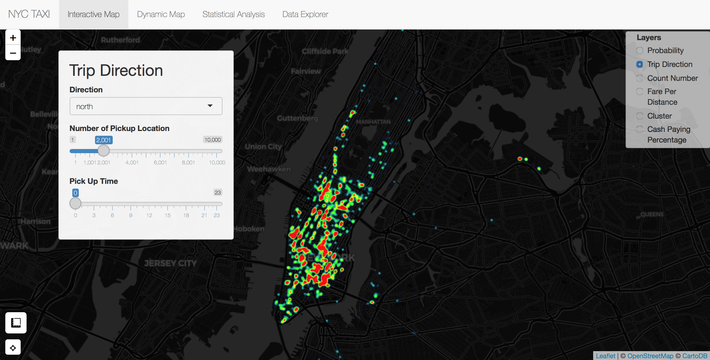

# Project 2: Shiny App Development Version 2.0



Term: Fall 2018

+ Team : Section 1, Group 2
+ **NYC Taxi Data**: + Team members
	+ Yingqiao Zhang
	+ Hongru Liu
	+ Liu Han
	+ Hengyang Lin
	+ Bailey Pierson

+ **Project summary**: Building upon a prior version of an application, we improved app usability by collapsing multiple tabs into one central window for interactive map exploration and by extending functionality to include new data elements and well as a heat map visualization and statistical Analysis.

+ **Project Improvement**: We improved this project by adding one function and two statistical exploration. 
The function is added in interactive map. By the heatmap showed, users could look over taxi pick-up or drop-off density locally, or could search best locations for them to get a taxi with in 250 meters. The locations are recommended by kmeans algorithm using pick-up and drop-off data in three hours, and we provide a button for users to locate themselves as well as a tool to measure the distance between the point of departure and the points we recommended.

The two statistical explorations consist of heatmaps which focus on taxi driving direction analysis, and statstical graphs which are about fare. From these exlorations, users are able to get a rough estimation on how much fare and time they would cost.

The layers of map have also been adjusted to make the interaction more clearly and logically.

Following [suggestions](http://nicercode.github.io/blog/2013-04-05-projects/) by [RICH FITZJOHN](http://nicercode.github.io/about/#Team) (@richfitz). This folder is orgarnized as follows.

```
proj/
├── app/
├── lib/
├── data/
└── output/
```

Please see each subfolder for a README file.

